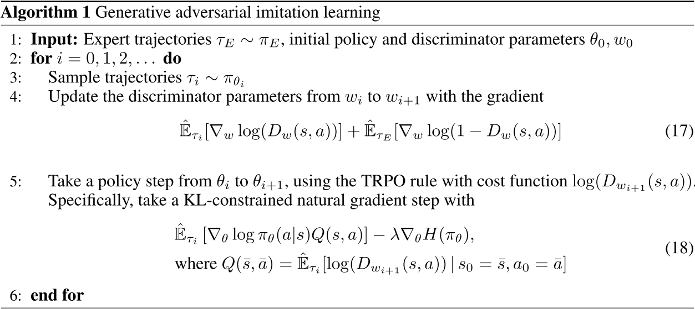
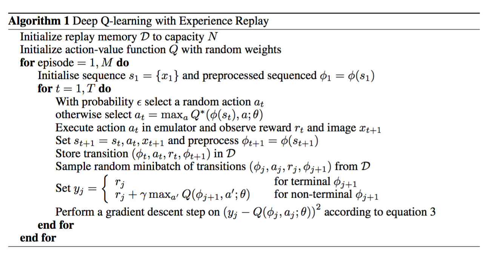
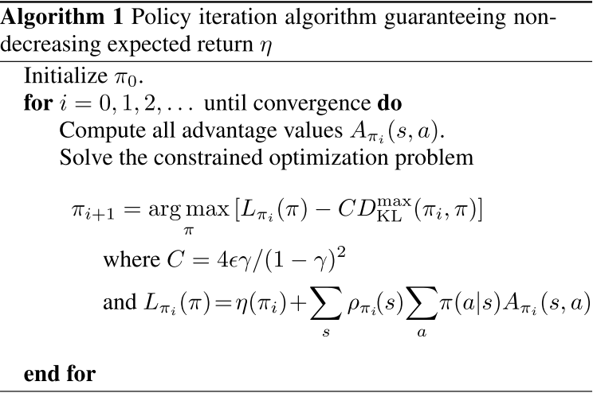

# Implementing GAIL

Practice project for stepping into DL research projects

## Notes of GAIL (pending)

### General Understanding

- **Intro / contribution**
- [GAIL (Generative Adversarial Imitation Learning)](https://arxiv.org/abs/1606.03476) proposed a <u>new general framework (part 3) for solving a sort of Imitation learning problem</u> that only offers a bundle of expert trajectories;
  - It also <u>instantiate an algorithm using a discriminator</u> (part 4, 5) that act like GAN.

<!-- - ~~**Related Works**~~

  - ~~Behavior Cloning~~
  - ~~<u>Inverse Reinforcement Learning</u>~~
    - ~~cost function `(???)`~~ 
    - ~~prioritize entire trajectories over others `(???)`~~
    - ~~expensive to run (computational expensive) `(???)`~~
    - ~~indirect yield actions (cost function as bridge layer)~~

- ~~**Math Background**~~ 

- ~~**Notations**~~ 

- ~~**Method**~~

  - ~~[method]~~
  - ~~[insight]~~
    - ~~[relation with TRPO], [model free vs. model based] ,[relation with GAN], [harness generative adversarial training, fit distributions of states & actions defining expert behavior]~~ 

- ~~**Interesting Parts & Drawbacks**~~

- ~~**Future works**~~ -->

- **Experiment**

  - baseline: 

    - [Behavior Cloning], [Feature Expectation Matching (FEM)], [Game-Theoretic Apprenticeship Learning (GTAL)]

  - physic-based control tasks:

    [Cartpole, Acrobot, Mountain Car, HalfCheetah, Hopper, Walker, Ant, Humanoid, Reacher]

  - result

    - out performs basslines
    - reach good results

- **Future Reading**

   ⋯

### Related Works

- [IRL]
- [GAN]
- [TRPO]
- [Andrew's Proj]

### Math

 	⋯

## Implementation

### Prerequisites

* **TRPO**
  * [[tutorial(Chinese)](https://zhuanlan.zhihu.com/p/26308073)]
  * used in GAIL when:
    * generating expert behavior
    * updating GAIL's policy
    * providing baseline of experiments
* **GAN**

### Key Info

- [TRPO](https://arxiv.org/abs/1502.05477): [[tutorial](https://spinningup.openai.com/en/latest/algorithms/trpo.html)]
- $\mathop{\min}\limits_{\pi_\theta} \mathop{\max}\limits_{D_\omega} V(D_\omega\, \pi_\theta) = \mathbb{E}_\pi[log_\pi()D(s,a)] + \mathbb{E}_{\pi_E}[log(1-D(s,a))] - \lambda H(\pi)$
- 
  * discriminator $D$: use **Adam** to to step on $\omega$ to increase object.
  * policy set $\Pi$: use **TRPO** to step on $\theta$ to decrease object.

### Log (tech records)

* **Setup Envs**
  
  * install envs
    * spinningup, Mujoco,Gym, rendering packages, ⋯
    * PyCharm remote interpreter
    * X11, Jupyter, ⋯
  * cross platform development settings
    * ⋯
  
* **Practice Implementing Skills**

  * requirements list:
    - "actor-critic"? (memory)
    - using Gym
      - [ ] setup & "SOP" of Gym `env` 

    - learn PyTorch
      - [ ] optimizer, gradient bind/detach
      - [ ] nn utils
      - [ ] "coding fromat"
    - general coding format
      - [ ] code structure (parts, key functions, ⋯) for RL
      - [ ] common data structure to use
      - [ ]  ⋯

  * practice project: DQN (Cartpole)
    
    * [DQN](https://www.cs.toronto.edu/~vmnih/docs/dqn.pdf): [[tutorial(Chinese)](https://zhuanlan.zhihu.com/p/21421729)]
    * 
    * $L(\omega) = \mathbb{E}[(r + \gamma\max Q(s', a', \omega) - Q(s, a, \omega))^2]$

* **TRPO (Cartpole):**
  
  * basic understand for implementation:
    * 
    * $\mathop{\text{maximize}}\limits_{\theta} E_{s\pi_{\theta_{old}}, a_{\theta_{old}}}[\frac{\pi_\theta(a | s)}{\pi_{\theta_{old}}(a | s)} A_{\theta_{old}}]$ s.t. $E_{s\pi_{\theta_{old}}} [D_{KL}(\pi_{old}(\cdot | s) || \pi_\theta(\cdot | s))] \le \delta$
  * implementation plan
    *  ⋯
  
* GAIL

  *  ⋯

### Techs Learn/Review

- TRPO
  - [ ] KL-Divergence
  - [ ] surrogate advantages
  - [ ] Convex Optimization
  - [ ] Huber loss
  - [ ] review: Kernels
  - [ ] review: Lagrangian duality
  - [ ] review: Hessian
- Linux
  - review: what happens when `sudo apt update` and `sudo apt upgrade`?

## How to use

## 

## Appendix: Cross-Platform(win-2-ubuntu) Development

The idea is to write code to run on Linux server to utilize its powerful device and develop and debug it on Windows working pc to leverage its convenience (PyCharm on Windows rather vim in bash)

This cross-platform development has majorly two requirements: **sharing files** & **sharing running environments**. In order to share files/code, you can use GitHub to do sync between Windows pc and Linux server, or mount Windows folder to Linux machine, or use PyCharm to open remote projects via SFTP/SSH. The latter two way is more convenient since it allows you to sync small changes without archive a new commit to GitHub server. For sharing environments, I just use PyCharm to run remote interpreters.

Another way of running code from a remote machine is using Jupyter: run Jupyter service on server and edit/test it on local (Windows) machine. BTW, newly released PyCharm also supports Jupyter, which means you can debug and set watch variables in Jupyter environments.

There is a tricky issue to run Gym remotely: how to render graphics generated by Linux machine on Windows machine. I am also exploring this. Currently, I find using Jupyter can render images/videos smoothly, using X11 to render graphics generated by WSL on Windows machine also works sometimes. Running remote(on Linux server) code that renders graphics with Gym using PyCharm will cause `pyglet.canvas.xlib.NoSuchDisplayException: Cannot connect to "None"` error, which is pretty annoying.

My current developing tools/envs are listed below for reference:

- Environments:
  - develop on: `Windows_10` 
  - local debug: `WSL (Ubuntu_18.06)`
  - deploy: `Ubuntu_16 server` 
- Version Control: Git
  - share project progress and update code
- cross platform developing: `PyCharm ` SFTP protocol support
  - use remote interpreter to develop and test
  - sync code
- Develop & Test (context keeper): `Jupyter Notebook`
- Graphics Rendering: 
  - X11: add remote display on WSL/Linux and render graphics on windows: [[tutorial](https://dibranmulder.github.io/2019/09/06/Running-an-OpenAI-Gym-on-Windows-with-WSL/)], [[issue](https://stackoverflow.com/questions/40195740/how-to-run-openai-gym-render-over-a-server)]
  - Jupyter: use `matplotlib.pyplot`
